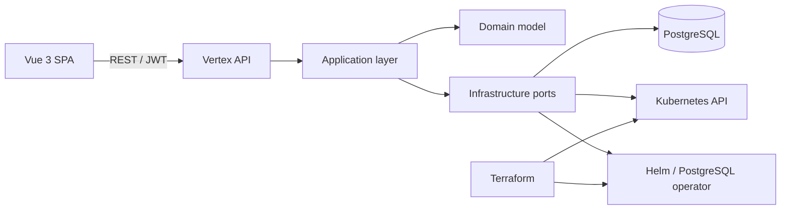

# Vertex

Vertex is a modern Internal Developer Platform for teams that want a friendly, safe control plane for Kubernetes applications. It brings cluster health, application delivery, temporary environments, secrets, managed PostgreSQL, and logs into one focused workspace.

The repository is deliberately shaped like a real product: a small vertical-slice MVP, clean boundaries, local demo mode, and replaceable infrastructure adapters for the next stage of the platform.

## Product surface

- Dashboard: cluster health, workload counts, resource usage, and recent events
- Applications: deployment inventory, restart, scale, delete, logs, and a guided deploy wizard
- Environments: namespace lifecycle with ResourceQuota and LimitRange intent
- Secrets: CRUD for opaque Kubernetes secrets with a protected-value UX
- Databases: PostgreSQL provisioning contract with connection details
- Logs: searchable, auto-scrolling pod log viewer
- Settings: cluster capabilities and platform configuration

## Architecture



The backend follows Clean Architecture:

```text
backend/src/
  Vertex.Domain/          Entities, value objects, domain rules
  Vertex.Application/     Use cases, contracts, validators, ports
  Vertex.Infrastructure/  EF Core, PostgreSQL, Kubernetes adapters, seed data
  Vertex.Api/             FastEndpoints, auth, middleware, composition root
```

The frontend is feature-based so each domain surface can grow without turning the app into a component monolith.

## Screenshots

Screenshots are intentionally left as placeholders until the product has a stable visual baseline:

```text
docs/screenshots/dashboard.png
docs/screenshots/applications.png
```

## Local development

### Prerequisites

- .NET SDK 10
- Node.js 22+
- Docker Desktop

### Run with demo data

The API defaults to an in-memory database and a deterministic Kubernetes simulator, which makes the UI available without a cluster.

```powershell
dotnet run --project backend/src/Vertex.Api
cd frontend
npm install
npm run dev
```

The API runs at `http://localhost:5000`; the Vue console runs at `http://localhost:5173`. Open the console URL, not the API URL. The API root intentionally has no UI route, so `http://localhost:5000/` returns 404; use `/health/live` or the `/api/*` endpoints instead.

The local account is:

```text
Email:    admin@vertex.local
Password: vertex-dev
```

### Run dependencies with Docker Compose

```powershell
docker compose up --build
```

The production-shaped compose profile starts PostgreSQL, Redis, the API, and the frontend. The API is available at `http://localhost:5080` and the UI at `http://localhost:8080`.

## Configuration

The most important API settings are:

| Setting | Default | Purpose |
|---|---|---|
| `Database__UseInMemory` | `true` | Use a local in-memory store for fast onboarding |
| `ConnectionStrings__Postgres` | `Host=localhost;...` | PostgreSQL connection when in-memory mode is off |
| `Kubernetes__Mode` | `Demo` | `Demo` or `Cluster` adapter |
| `Jwt__Key` | development key | Signing key; replace in every real environment |
| `Cors__Origins__0` | `http://localhost:5173` | Allowed browser origin |

## Terraform and Kubernetes

Terraform is organized into modules for network, monitoring, and the Vertex platform. The root module provisions the namespace, PostgreSQL, Redis, Prometheus, Grafana, ingress-nginx, cert-manager, and the Vertex workloads. Credentials and cloud-specific networking are inputs rather than hard-coded values.

```powershell
cd terraform
terraform init
terraform plan -var="environment=dev"
terraform apply -var="environment=dev"
```

The Helm chart in `helm/vertex` can also be installed directly:

```powershell
helm upgrade --install vertex ./helm/vertex --namespace vertex --create-namespace
```

## Deployment notes

1. Build and publish the API and frontend images from their Dockerfiles.
2. Create a production `terraform.tfvars` containing PostgreSQL and JWT secrets.
3. Apply the Terraform root module to install cluster dependencies and the platform.
4. Set `kubernetes_mode=cluster` and point the API service account at the target cluster.
5. Configure TLS through cert-manager and the supplied ingress resources.

The API exposes `/health/live` and `/health/ready`. Workload manifests include resource requests/limits, probes, a PodDisruptionBudget, and HPA-ready labels/configuration.

## Roadmap

- GitHub, GitLab, and Azure DevOps source integrations
- Argo CD application synchronization
- Multi-cluster target selection
- OIDC login, RBAC, and team/project ownership
- Audit log and notification center
- Plugin SDK for custom resource providers
- SLO dashboards and richer Prometheus queries

## License

Vertex is an architectural MVP intended to evolve into an open-source developer platform.
